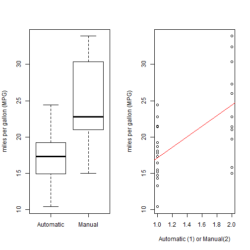

#  Summary

There is a set of variables related to miles per gallon (MPG) (outcome).

Here the difference of the MPG between automatic and manual transmissions is focused, 
the `mtcars` dataset in car package is taken as the data source, 
and techniques about regression models is used to solve the following two questions:

* "Is an automatic or manual transmission better for MPG"
*  "Quantifying how different is the MPG between automatic and manual transmissions?"


# Data Processing

## Load and Test Data

> The data was extracted from the 1974 Motor Trend US magazine, and comprises fuel consumption and 10 aspects of automobile design and performance for 32 automobiles (1973-74 models).


```r
library(datasets)
mpgData <- with(mtcars, data.frame(mpg, am))
mpgData$am <- factor(mpgData$am, labels = c("Automatic", "Manual"))
#summary(mpgData)
```

## Process Data

### Question 1: Is an automatic or manual transmission better for MPG?  


```r
summary(mpgData[mpgData$am == "Automatic",])
```

```
##       mpg               am    
##  Min.   :10.4   Automatic:19  
##  1st Qu.:14.9   Manual   : 0  
##  Median :17.3                 
##  Mean   :17.1                 
##  3rd Qu.:19.2                 
##  Max.   :24.4
```

```r
summary(mpgData[mpgData$am == "Manual",])
```

```
##       mpg               am    
##  Min.   :15.0   Automatic: 0  
##  1st Qu.:21.0   Manual   :13  
##  Median :22.8                 
##  Mean   :24.4                 
##  3rd Qu.:30.4                 
##  Max.   :33.9
```

### Question 2: Quantifying how different is the MPG between automatic and manual transmissions?  


```r
fit <- lm(mpg ~ as.integer(am), data=mpgData)
summary(fit)
```

```
## 
## Call:
## lm(formula = mpg ~ as.integer(am), data = mpgData)
## 
## Residuals:
##    Min     1Q Median     3Q    Max 
## -9.392 -3.092 -0.297  3.244  9.508 
## 
## Coefficients:
##                Estimate Std. Error t value Pr(>|t|)    
## (Intercept)        9.90       2.63    3.77  0.00072 ***
## as.integer(am)     7.24       1.76    4.11  0.00029 ***
## ---
## Signif. codes:  0 '***' 0.001 '**' 0.01 '*' 0.05 '.' 0.1 ' ' 1
## 
## Residual standard error: 4.9 on 30 degrees of freedom
## Multiple R-squared:  0.36,	Adjusted R-squared:  0.338 
## F-statistic: 16.9 on 1 and 30 DF,  p-value: 0.000285
```

# Results
So, manual transmission is better than automatic for MPG, which increased by 7.2449.

# Appendix

## Figure 1. MPG between automatic and manual transmissions

```r
par(mfrow=c(1,2))
with(mpgData,{
     boxplot(mpg ~ am, 
             ylab = "miles per gallon (MPG)")
     plot(mpg ~ as.integer(am),
             xlab = "Automatic (1) or Manual(2)",
             ylab = "miles per gallon (MPG)")
     abline(fit, col=2)
     })
```

 

## SourceCode
[regmodel-mtcars.Rmd](https://github.com/anupamaangadi/regressionmodels-course-project/regmodel-mtcars.Rmd)
